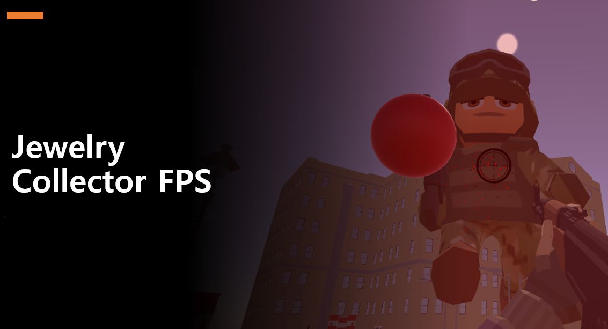
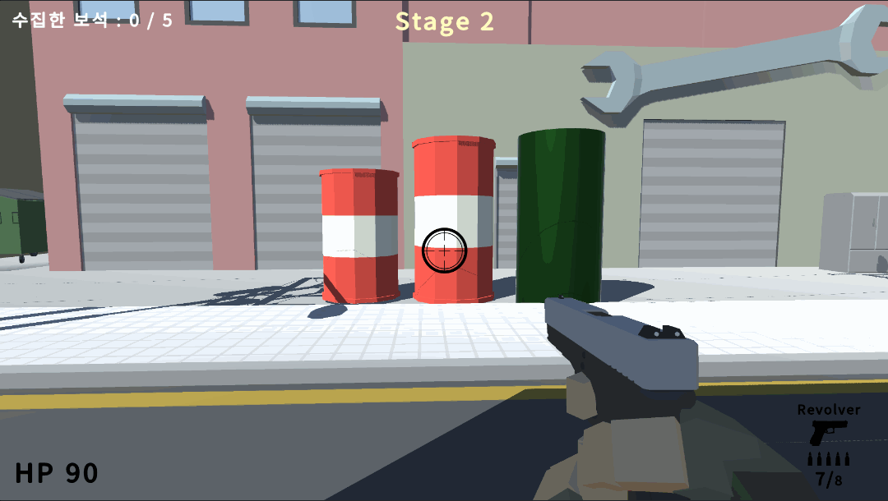
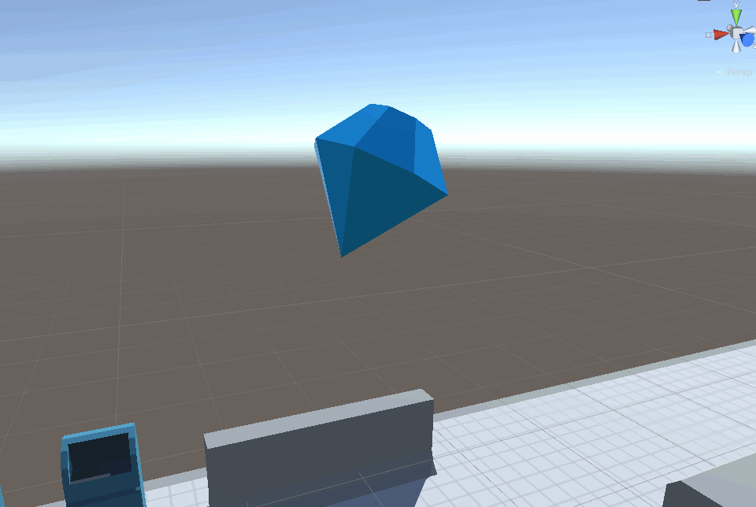
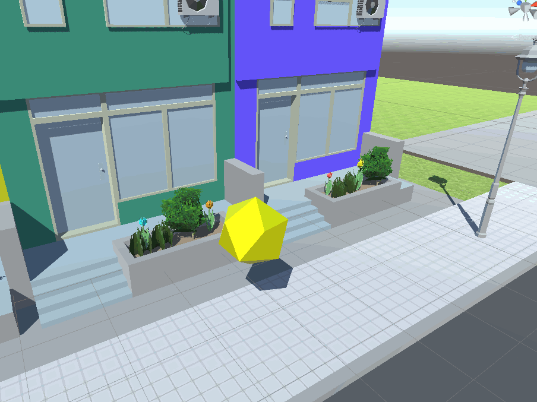
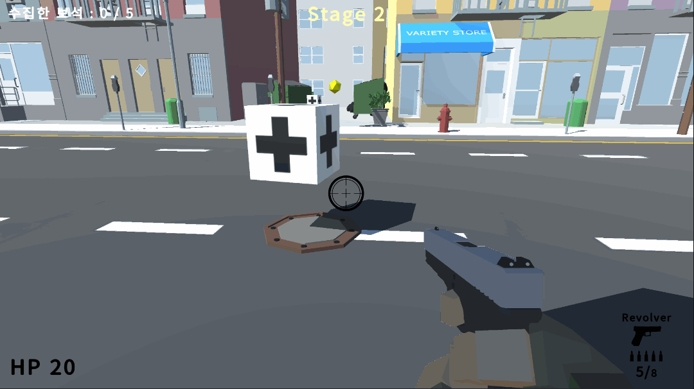

# 💎 Jewelry Collector FPS

🎮 *Jewelry Collector FPS*는 Unity로 개발된 1인칭 슈팅(FPS) 게임입니다.  
플레이어는 다양한 무기를 활용해 적을 처치하고, 보석을 모아 다음 스테이지로 진입하며  
보스를 물리쳐 최종 클리어를 달성하는 것을 목표로 합니다.

> 본 프로젝트는 Unity 수업의 기말 과제로 1인 개발하였으며, FPS의 기본 시스템은 유튜브 강의를 기반으로 구현하였습니다.  
> 본 빌드는 **배경 음악(BGM)이 포함되지 않은 버전**입니다.

---

## 📌 주요 기능

- 🕹️ FPS 시점 구현 (카메라 회전, 이동, 점프)
- 🔫 다양한 무기 (소총, 권총, 나이프, 수류탄, 총기 스위칭)
- 🧠 적 AI FSM (대기/배회/추적, 공격)
- 🎯 사격/재장전 시스템, 총구 이펙트, 탄피 배출
- 🔁 무기 교체, 줌인/견착 모드 전환
- 🧨 폭발 드럼통 및 파괴 오브젝트
- 💎 보석 수집 및 스테이지 전환
- 💡 UI 시스템 (체력, 탄약, 수집 현황, 스테이지 정보)
- 🧪 메모리 풀링 적용 (탄피, 적 등 최적화)
- 🎬 보스 구현 및 엔딩 크레딧

---

## 🎮 조작 방법

| 키            | 기능                  |
| ------------- | --------------------- |
| `WASD`        | 이동                  |
| `마우스 이동` | 시점 회전             |
| `좌클릭`      | 무기 발사             |
| `우클릭`      | 조준 (에임 모드 전환) |
| `R`           | 재장전                |
| `1~4`         | 무기 전환             |

---

## 🖼️ 스크린샷 & GIF

| 장면                                | 설명                                                                                                                   |
| ----------------------------------- | ---------------------------------------------------------------------------------------------------------------------- |
|         | 🎮 **게임플레이1 (일반 스테이지)**: 적과의 기본 전투를 체험할 수 있습니다.                                             |
|         | 🧟 **게임플레이2 (보스 스테이지)**: 강력한 보스와의 최종 결전을 진행합니다.                                            |
|  | 💥 **폭발하는 드럼통**: 충격을 가하면 폭발! 주변의 적이나 플레이어에게 큰 피해를 줄 수 있어요. 부숴지는 드럼통도 존재! |
|    | 💥⚙️ **드럼통 + 물리엔진**: 폭발은 주변 환경을 변화시킬 수 있습니다.                                                   |
|  | 💎 **수집 요소1 (보석)**: 모든 보석을 수집하면 다음 스테이지로 이동!                                                   |
|  | 💎 **수집 요소2 (보석)**: 보석을 놓치지 마세요! 늦어질수록 적들이 많아집니다!                                          |
|         | 🧴 **힐링 아이템**: 체력을 회복시켜주는 귀한 생명줄! 위기에서 구해줍니다.                                              |
|         | 🔫 **재장전 아이템**: 부족한 탄약을 빠르게 보충할 수 있는 필수 아이템!                                                 |
|     | 🧨 **무기 전환**: 소총, 권총, 단검, 수류탄까지! 숫자키로 빠르게 무기를 전환할 수 있어요.                               |

> 📁 GIF 파일: `docs/gifs/`

---

## 🎓 참고한 강의

FPS 게임의 기본 시스템(이동, 사격, 무기 교체, 아이템 등)은 아래 유튜브 강의를 기반으로 구현하였습니다.

- [유니티 FPS 강좌 - 고박사의 유니티 노트 (1~20편 참고)](https://www.youtube.com/watch?v=GvtZDGN_kbQ)

---

## 🎨 사용한 에셋

다음은 본 프로젝트에서 사용된 무료 Unity 에셋입니다.  
해당 에셋들은 **Extension Asset 라이선스**를 따릅니다.
이 저장소에는 포함되어 있지 않으며, 아래 링크를 통해 직접 다운로드 가능합니다.

- [Low Poly Shooter Pack - Free Sample](https://assetstore.unity.com/packages/templates/systems/low-poly-shooter-pack-free-sample-144839)
- [FPS Icons Pack](https://assetstore.unity.com/packages/2d/gui/icons/fps-icons-pack-45240)
- [Toon Muzzleflash Pack](https://assetstore.unity.com/packages/2d/textures-materials/toon-muzzleflash-pack-56572)
- [CITY package](https://assetstore.unity.com/packages/3d/environments/urban/city-package-107224)
- [Toony Tiny Soldiers Demo](https://assetstore.unity.com/packages/3d/characters/toony-tiny-soldiers-demo-180904)
- [Simple Gems and Items Ultimate Animated Customizable Pack](https://assetstore.unity.com/packages/3d/props/simple-gems-and-items-ultimate-animated-customizable-pack-73764)

---

## 🚀 실행 방법

1. Unity Hub에서 본 프로젝트를 열어주세요.  
   권장 버전: **Unity 2021.3.21f1 (LTS)**

2. 프로젝트가 열리면, 아래 경로의 씬 파일을 실행하세요:

   `Assets/MainScene.unity`
   또는 Unity 상단의 **Project 창**에서 `MainScene.unity`를 더블 클릭하면 씬이 열립니다.

3. 상단의 ▶️ **Play 버튼**을 클릭하여 게임을 실행하세요.

> 참고: 외부 에셋은 포함되어 있지 않으며, 빌드된 `.exe` 파일은 [Releases](https://github.com/Joycong/Jewelry-Collector-FPS/releases)에서 직접 실행할 수 있습니다.

---

## 🔧 개발 환경

- Unity 버전: **2021.3.21f1 (LTS)**
- 프로그래밍 언어: C#
- 개발 방식: 1인 개발
- 개발 기간: **학습 포함 약 2개월 (2023.4 ~ 2023.6)**

---

## 📦 다운로드

게임 빌드는 아래 링크에서 다운로드 할 수 있습니다.

- 👉 [Jewelry Collector FPS v1.0 다운로드](https://github.com/Joycong/Jewelry-Collector-FPS/releases)

MY FPS GAME.exe를 실행하여 플레이하실 수 있습니다.

---

## 👨‍💻 개발자

**전우진**

- GitHub: [@Joycong](https://github.com/Joycong)

---

## 📄 라이선스

본 프로젝트는 교육용으로 제작된 데모 게임입니다.  
코드의 일부는 학습 자료를 참고하였으며, 에셋은 Unity Asset Store의 무료 에셋만 사용하였습니다.
